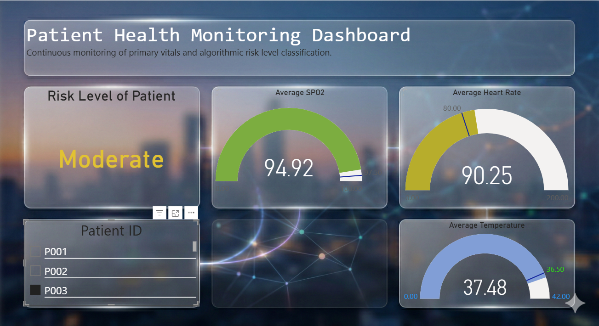

# Patient Health Monitoring Pipeline on GCP


Real-time patient vital signs monitoring system built on **Google Cloud Platform (GCP)** using:
- **Pub/Sub** for event streaming
- **Apache Beam Dataflow** for streaming ETL (Medallion Architecture)
- **Cloud Storage (GCS)** for Bronze/Silver layers
- **BigQuery** for Gold layer analytics
- **Power BI** for visualization and monitoring

## 🎯 Architecture Overview

```
Patient Vitals Simulator ──(JSON)──> Pub/Sub Topic ──(Subscription)──> Dataflow Pipeline
                                                                              │
                                                                  ┌────────────┼────────────┐
                                                                  │            │            │
                                                               Bronze        Silver       Gold
                                                               (Raw GCS)   (Clean GCS)  (BQ Table)
```

### Medallion Architecture Layers:
1. **Bronze** (`raw_data/*.json`): Raw Pub/Sub messages (windowed every 60s)
2. **Silver** (`cleaned_data/*.json`): Validated, enriched records (risk score/level)
3. **Gold** (`healthcare.patient_risk_analytics`): Aggregated 1-min patient summaries (avg vitals, max risk)

## 🛠️ Prerequisites

1. **GCP Project** with billing enabled
2. **APIs Enabled**:
   - Cloud Pub/Sub API
   - Dataflow API
   - BigQuery API
   - Cloud Storage API
3. **Service Account** with roles:
   - `roles/dataflow.worker`
   - `roles/pubsub.publisher`
   - `roles/bigquery.dataEditor`
4. `gcloud CLI` authenticated: `gcloud auth login`

## 🚀 Quick Start

### 1. Clone & Setup
```bash
git clone <repo>
cd patient-health-monitoring
pip install -r requirements.txt  # apache-beam[gcp], google-cloud-pubsub, python-dotenv
```

### 2. Configure `.env` (create in both `dataflow/` & `simulator/`)
```env
GCP_PROJECT=your-project-id
PUBSUB_TOPIC=patient-vitals-topic
PUBSUB_SUBSCRIPTION=patient-vitals-sub  # auto-created by pipeline if missing
BRONZE_PATH=gs://your-bucket/bronze/
SILVER_PATH=gs://your-bucket/silver/
BIGQUERY_TABLE=your-project-id.healthcare.patient_risk_analytics
TEMP_LOCATION=gs://your-bucket/temp/
STAGING_LOCATION=gs://your-bucket/staging/
REGION=us-central1  # Dataflow region
PATIENT_COUNT=20
STREAM_INTERVAL=2  # seconds
ERROR_RATE=0.1
```

**Create GCS bucket**:
```bash
gsutil mb gs://your-bucket/
```

### 3. Create Pub/Sub Resources
```bash
# Simulator publishes to topic
gcloud pubsub topics create patient-vitals-topic

# Pipeline reads from subscription (auto-created)
```

### 4. Run Vitals Simulator (local/Cloud Run)
```bash
cd simulator
python vitals_simulator.py
```
- Generates vitals for 20 patients every 2s
- Injects 10% error records (missing fields, invalid ranges)
- Publishes JSON to Pub/Sub

**Sample Record**:
```json
{
  "patient_id": "P001",
  "timestamp": "2024-01-01T12:00:00Z",
  "heart_rate": 85.2,
  "spo2": 97.5,
  "temperature": 37.1,
  "bp_systolic": 120.4,
  "bp_diastolic": 80.2
}
```

### 5. Deploy Dataflow Pipeline
```bash
cd dataflow
python streaming_medallion_pipeline.py
```
- **Streaming job** (no end)
- Fixed 60s windows
- **Validation**: SpO2 (0-100), HR (0-200), Temp (30-45)
- **Enrichment**: Risk score (weighted HR/temp/SpO2), level (Low/Mod/High)
- **Gold Aggregation**: Per-patient avgs + max_risk_level

## 🔍 Data Processing Details

### Silver Enrichment Formula:
```
risk_score = (HR/200)*0.4 + (Temp/40)*0.3 + (1 - SpO2/100)*0.3
risk_level: <0.3=Low, <0.6=Moderate, >=0.6=High
```

### BigQuery Schema (`patient_risk_analytics`):
| Field          | Type  | Description              |

| patient_id     | STRING| P001                     |
| avg_heart_rate | FLOAT | 82.5                     |
| avg_spo2       | FLOAT | 97.2                     |
| avg_temperature| FLOAT | 37.1                     |
| max_risk_level | STRING| High/Moderate/Low        |

**Query Example**:
```sql
SELECT patient_id, avg_heart_rate, max_risk_level
FROM `your-project.healthcare.patient_risk_analytics`
WHERE max_risk_level = 'High'
ORDER BY avg_heart_rate DESC;
```

## 📊 PowerBI Dashboard (Real-time DirectQuery)

Connect PowerBI Desktop to BigQuery Gold table for **live patient vitals monitoring**.

### 🚀 Quick Setup
1. **PowerBI Desktop** → Get Data → BigQuery
2. **Project**: `your-project-id`, **Dataset**: `healthcare`, **Table**: `patient_risk_analytics`
3. **Authentication**: OAuth2 or Service Account JSON key (roles: `bigquery.dataViewer`)
4. **Mode**: **DirectQuery** (real-time, no import delays)
5. **Refresh**: Auto (streaming data visible in ~seconds)

### 📈 Recommended Visuals
| Visual | Measures | Purpose |
|--------|----------|---------|
| **Line Chart** | `avg_heart_rate`, `avg_spo2` by `patient_id` + timestamp | Vitals trends (latest 1h) |
| **Card** | `max_risk_level` (High count), `AVERAGE(avg_heart_rate)` | Current status |
| **Table** | Top patients by `avg_heart_rate` where `max_risk_level = "High"` | Alert list |
| **Gauge** | `avg_spo2` threshold (>95 green) | Compliance |

**Sample DAX for High-Risk Alerts**:
```dax
High Risk Count = 
CALCULATE(
    COUNTROWS('patient_risk_analytics'),
    'patient_risk_analytics'[max_risk_level] = "High"
)
```

### 🌐 Publish & Share
- Publish to **PowerBI Service**
- Pin to Dashboard → Auto-tile refresh
- Share app/reports (workspace permissions)
- Embed in clinical portals

**Dashboard Screenshot**:


> *Live PowerBI dashboard: real-time vitals trends, high-risk alerts, patient metrics.* 

**Pro Tip**: Add `event_timestamp` from Silver for sub-minute granularity if needed.

## 📊 Monitoring & Costs
- **Dataflow Console**: Job metrics (throughput, latency, errors)
- **Pub/Sub**: Message backlog
- **BigQuery**: Slot usage, query costs
- **GCS**: Storage lifecycle policies

**Estimated Costs** (20 patients, 2s interval):
- Dataflow: ~$0.50-1/day (F1 instance)
- Pub/Sub: <$0.01/day
- BigQuery Storage: <$0.01/day
- GCS: Negligible

## 🧪 Testing

1. **Error Handling**: Invalid records filtered (logs in Dataflow)
2. **Windowing**: Verify 60s aggregations
3. **Risk Scoring**: Check High-risk patients in BQ

## 🔧 Troubleshooting

| Issue | Solution |
|-------|----------|
| `PermissionDenied` | Check service account roles |
| `Subscription not found` | Pipeline auto-creates |
| `Pipeline failed` | Check Dataflow logs for .env vars |
| No data in BQ | Verify topic → subscription → pipeline |

## 🎉 Next Steps
- [✅] PowerBI Dashboard (DirectQuery to BigQuery Gold)
- [ ] Add alerting (Pub/Sub → Cloud Functions → email)
- [ ] ML model for anomaly detection
- [ ] Multi-region deployment

## 📫 Connect with Me  
**Author:** *Nitin yadav*